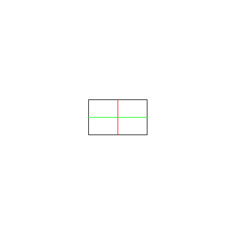
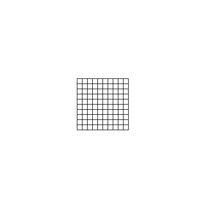
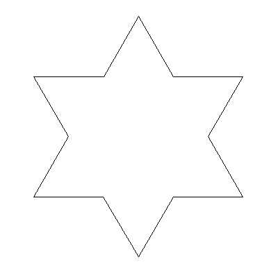
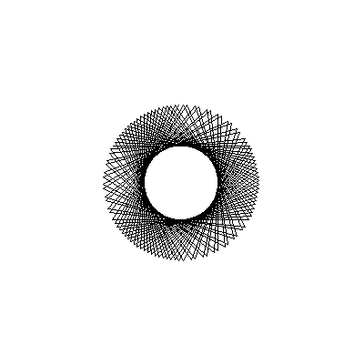

# Projet_TLC

Composition du groupe : 
- Vincent COMMIN
- Louis LEENART

# Introduction

Dans le cadre de l'UE Théorie des Langages et Compilation, nous avons créé le langage `CLurtle`, avec `.cl` comment extension (pour **C**ommin-**L**eenart-T**urtle**) ayant pour cible un langage avec une syntaxe accessible au novices pour la manipulation d'une tortue de dessin. La liste des opérations disponibles est la suivante :
- Baisser/Lever le crayon
- Deplacer la tortue (position et rotation)
- Dessiner des formes basiques (line et rectangle)
- Changer la couleur du crayon
- Utiliser des variables (uniquement entières) et effectuer des opérations basiques
- Utiliser des structures de contrôle (for, while, if/then, if/then/else)

Note : nous avons réalisé une extension pour l'éditeur Visual Studio Code qui supporte la syntaxe de notre langage ainsi que quelques snippets, disponible ici : [CLurtle-syntax-highlighting](https://marketplace.visualstudio.com/items?itemName=TheBoJe.clurtle-syntax-highlighting), ou via la commande suivante : 

```
(Ctrl+P)
ext install theboje.clurtle-syntax-highlighting
```

# Exercices réalisés 

## Exercice 1

Le fichiers concernés sont :
- `lexer.ll`
- `exemples/quadrilataire.cl`
- `exemples/quadrillage.cl`

## Exercice 2

Le fichier concerné est :
- `parser.yy`

La syntaxe a respecter est décrite dans la section [Syntaxe](#syntaxe).

## Exercice 3

Les fichiers concernés sont : 
- `parser.yy`
- `clurtle_drawer/*`

Tous les fichiers de ce dossier (sauf `clurtle.cc/hh`,`clurtle_cpp.cc/hh`, `visitor.hh` et `CImg.h`) représentent les différents objets qui composent notre arbre syntaxique. Plus précisément, tous les objets implémentent `term.hh`. L'arbre est construit dans `parser.yy -> dans yyparse(clurtle::sequence **)`. Voir [Utilisation](#Utilisation) et `main.cc` pour plus de détails concernant la récupération de l'arbre syntaxique.

La vérification d'affectation sur les variables d'itération est interdite, et est testable via le fichier `exemples/affectation_pour.cl` (une erreur est attentue à la compilation).

## Exercice 4

Suite à la première itération de développement, nous avons remarqué quelques points d'amélioration (certains implémentés, d'autres non) :
- Spécification de la valeur initiale de la boucle POUR (initialement `POUR var ALLANT_A expr FAIRE`), mis à jour.
- Ajout de l'opérateur unaire `-`. Ne demande pas de changement majeur dans le code mais pas encore implémenté (on utilise `x * -1` pour le moment si on veut inverser le signe)
- Création de fonction. Demande un changement notable dans notre structure, surtout au niveau des différents visiteurs.
- Boucle `POUR` ne va que dans le sens positif (c'est à dire `POUR x DE i ALLANT_A j`, cela correspond forcément à `x < j; x++`). Demande une revue de la syntaxe de la boucle `POUR`, compliquant surement la syntaxe. 
- Ajout d'un printer pour afficher la valeur d'une expression dans la console. Ne demande pas de changement majeur dans le code.
- Ajout de la forme de dessin `CERCLE %rayon%;`, dont l'ajout serait sans difficultés.
- Utiliser `float` pour la position au lieu de `int` afin de limiter les imprecisions de calcul. Nous aurions pu modifier la syntaxe du code CLurtle, mais avons décidé de seulement modifier la manière d'exploiter l'arbre syntaxique créé (qui utilise des floats pour la position et non pas des ints).
- Ajout de commande pour l'initialisation (taille de l'image, nom de l'image et de la fenêtre, etc). 

## Exercice 5

Nous avons décidé de réaliser deux approches différents pour l'exploitation de l'arbre syntaxique créé - toutes deux bassées sur la mécanique du visiteur évidemment.

La première, `clurtle.cc` 
<!-- TODO Vincent -->

La seconde, `clurtle_cpp.cc` se contente de transformer le code `.cl` en `.cpp` avec un minimum de modifications.

# Syntaxe

## Commandes du crayon

- `BAISSER;` : baisse le crayon et permet l'écriture lors du déplacement de celui-ci
- `LEVER;` : lève le crayon et ne permet pas l'écriture lors du déplacement
- `CHANGER_COULEUR %couleur|R G B%;` : change la couleur RGB du crayon (soit une couleur prédéfini par les presets [Couleurs](#Couleurs), soit par un code RGB ie : `0 45 21`)

## Commandes du déplacement

- `AVANCER %distance%;` : avance dans la direction dans laquelle la tortue est tournée de `distance` unités, avec `distance` est une expression (entier, variable, ou résultat d'opération, voir la section [Variables, affectations, conditions et expressions](#Variables,-affectations,-conditions-et-expressions) pour plus de détails). Si la position du crayon est `BAISSER`, alors la tortue dessinera sur son chemin
- `TOURNER %degré%;` : tourne de `degré` degré(s). `degré` est une expression, voir la section [Variables, affectations, conditions et expressions](#Variables,-affectations,-conditions-et-expressions)
## Commandes de formes

- `LIGNE %distance%;` : trace une ligne de `distance` pixels (`distance` étant une expression, voir la section [Variables, affectations, conditions et expressions](#Variables,-affectations,-conditions-et-expressions)), dans la direction dans laquelle la tortue est tournée. La tortue revient à la position initiale après avoir dessiné la ligne. La tortue ne dessinera rien si le crayon est levé
- `RECTANGLE %largeur% %longueur%` : dessine un rectangle de largeur `largeur` et de longueur `longueur` (`largeur` et `longueur` des expressions), dans la direction dans laquelle la tortue est tournée

## Structures de contrôle

- `POUR %incr% DE %val_init% ALLANT_A %portée% FAIRE ..... FIN_POUR;` : boucle pour prenant une variable `incr` qui sera initialisée à `val_init` et qui, pour chaque tour, sera incrémenté jusqu'à `portée` - 1. Le code dans le corps de la boucle sera exécuté à chaque tour. `%val_init%` et `portée` sont des expressions, et `incr` est un nom de variable (Note: il n'est pas possible de modifier `incr` dans le corps de la boucle) 
- `TANT_QUE %condition% FAIRE ..... FIN_TANT_QUE;` : boucle exécutant le code dans son corps tant que `condition` est vraie (cf [Variables, affectations, conditions et expressions](#Variables,-affectations,-conditions-et-expressions) pour l'utilisation des conditions).
- `SI %condition% FAIRE ..... SINON FAIRE ..... FIN_SI;` ou `SI %condition% FAIRE ..... FIN_SI;` : (cf [Variables, affectations, conditions et expressions](#Variables,-affectations,-conditions-et-expressions) pour l'utilisation des conditions)


## Variables, affectations, conditions et expressions

- Les variables doivent être en minuscules. Seuls les caractères de `a` à `z` et les `_` (si ceux-ci ne sont pas placés en début de mot) sont autorisés. `%nom_variable% <- %valeur%|%exp%` : affecte la valeur `valeur` à `nom_variable`. `valeur` peut être une expression. L'affectation et l'initialisation d'une variable sont confondues.
- Une expression correspond a : 
  - une variable
  - une valeur entière
  - la structure `expression OPERATEUR expression`, avec `OPERATEUR = [+|-|*|/|OU|ET|NON]`
  - une expression parenthésée
- Une condition est représentée par : 
  - `%exp1% SUP_A %exp2%` : vraie si `exp1` est strictement supérieur à `exp2`
  - `%exp1% SUP_EGAL_A %exp2%` : vraie si `exp1` est supérieur ou égal à `exp2`
  - `%exp1% INF_A %exp2%` : vraie si `exp1` est inférieur à `exp2`
  - `%exp1% INF_EGAL_A %exp2%` : vraie si `exp1` est inférieur ou égal à `exp2`
  - `%exp1% EGAL_A %exp2%` : vraie si `exp1` est égal à `exp2`

Note: l'opérateur `- expression` n'est pas supporté.

## Couleurs

Les couleurs sont représentées par soit leur nom, soit 3 entiers (ou 3 expressions) compris entre `0` et `255` inclus tel que `R G B`. Les couleurs connues avec leur nom sont les suivantes :
- `NOIR` :   (  0   0   0)
- `BLANC` :  (255 255 255)
- `ROUGE` :  (255   0   0)
- `VERT` :   (  0 255   0)
- `BLEU` :   (  0   0 255)
- `JAUNE` :  (255 255   0)
- `VIOLET` : (255   0 255)
- `CYAN` :   (  0 255 255)

Par exemple, pour changer la couleur du crayon, on peut :

```clurtle
# Par nom
CHANGER_COULEUR JAUNE;
# Par valeur
CHANGER_COULEUR 255 255 0;
# Par valeur avec expressions
x <- 100;
CHANGER COULEUR (2 * x) x 255; # violet-ish
```

## Exemples de code

Des exemples de codes sont dans `exemples/`. Voici quelques résultats obtenus, aussi bien avec `CLurtle` que `CLurtle_cpp` : 

|              Nom du fichier |              Résultat               |
| --------------------------: | :---------------------------------: |
| `exemples/quadrilataire.cl` |  |
|   `exemples/quadrillage.cl` |    |
|          `exemples/koch.cl` |           |
|        `exemples/etoile.cl` |         |

# Utilisation

## CLurtle

## CLurtle_cpp

### Problème connu

- Visibilité des variable non prise en compte dans .cl alors que pris en compte en CPP, ca plante à la compilation de cpp -> bin
